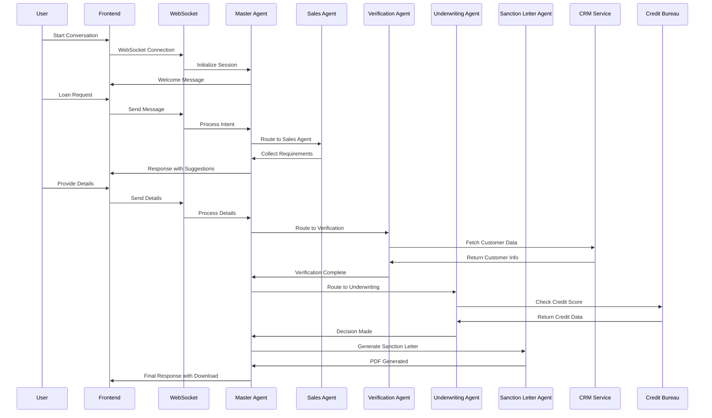

# 🔧 Technical Documentation - SunnyAI Loan Assistant

## 📋 Table of Contents

1. [System Architecture Deep Dive](#system-architecture-deep-dive)
2. [Multi-Agent Orchestration](#multi-agent-orchestration)
3. [Real-time Communication](#real-time-communication)
4. [Database Design](#database-design)
5. [Security Implementation](#security-implementation)
6. [Performance Optimization](#performance-optimization)
7. [Deployment Guide](#deployment-guide)

---

## 🏗️ System Architecture Deep Dive

### 🎯 **Architectural Patterns**

The system follows several key architectural patterns:

- **Multi-Agent Pattern**: Specialized agents for different business domains
- **Event-Driven Architecture**: WebSocket-based real-time communication
- **Layered Architecture**: Clear separation of concerns
- **Repository Pattern**: Data access abstraction
- **Strategy Pattern**: Pluggable business rules

### 🔄 **Request Flow Diagram**



---

## 🤖 Multi-Agent Orchestration

### 🧠 **Master Agent Implementation**

```python
class MasterAgent:
    def __init__(self, session_id: str, crm_service, credit_service, session_manager):
        self.session_id = session_id
        self.conversation_state = "greeting"
        self.user_context = {}
        
        # Initialize specialized agents
        self.sales_agent = SalesAgent()
        self.verification_agent = VerificationAgent(crm_service)
        self.underwriting_agent = UnderwritingAgent(credit_service)
        self.sanction_letter_agent = SanctionLetterAgent()
    
    async def process_message(self, user_message: str) -> Dict[str, Any]:
        """
        Central orchestration logic with state management
        """
        # Update context
        self.user_context["last_message"] = user_message
        self.user_context["timestamp"] = datetime.now().isoformat()
        
        # Handle greetings and name collection
        if self._is_greeting(user_message) and not self.user_context.get("name"):
            return await self._handle_greeting()
        
        # Route based on conversation state
        if self.conversation_state == "sales":
            return await self._handle_sales_flow(user_message)
        elif self.conversation_state == "verification":
            return await self._handle_verification_flow(user_message)
        elif self.conversation_state == "underwriting":
            return await self._handle_underwriting_flow(user_message)
        elif self.conversation_state == "sanction":
            return await self._handle_sanction_flow(user_message)
    
    async def _handle_sales_flow(self, user_message: str) -> Dict[str, Any]:
        """Handle sales agent interactions"""
        result = await self.sales_agent.process_message(user_message, self.user_context)
        
        if result.get("next_action") == "verification":
            self.conversation_state = "verification"
            self.user_context.update(result["collected_data"])
            return await self.verification_agent.start_verification(self.user_context)
        
        return result
```

### 🏪 **Sales Agent Specialization**

```python
class SalesAgent:
    def __init__(self):
        self.collected_data = {}
        self.current_step = "loan_amount"
    
    async def process_message(self, user_message: str, context: Dict[str, Any]) -> Dict[str, Any]:
        """
        Step-by-step data collection with validation
        """
        if self.current_step == "loan_amount":
            amount = self._extract_amount(user_message)
            if amount:
                self.collected_data["loan_amount"] = amount
                self.current_step = "tenure"
                return await self._ask_tenure(amount)
            else:
                return self._ask_amount_clarification()
        
        elif self.current_step == "tenure":
            tenure = self._extract_tenure(user_message)
            if tenure:
                self.collected_data["tenure"] = tenure
                self.current_step = "purpose"
                return await self._ask_purpose()
            else:
                return self._ask_tenure_clarification()
        
        # Continue with other steps...
    
    def _extract_amount(self, message: str) -> int:
        """
        Advanced NLP for amount extraction
        """
        import re
        
        # Handle "lakh" format
        lakh_pattern = r'(\d+(?:\.\d+)?)\s*(?:lakh|lakhs?)'
        lakh_match = re.search(lakh_pattern, message.lower())
        if lakh_match:
            return int(float(lakh_match.group(1)) * 100000)
        
        # Handle numeric format
        number_pattern = r'(\d+(?:,\d+)*)'
        number_match = re.search(number_pattern, message)
        if number_match:
            amount = int(number_match.group(1).replace(',', ''))
            if 50000 <= amount <= 4000000:
                return amount
        
        return None
```

### 🔐 **Verification Agent Security**

```python
class VerificationAgent:
    def __init__(self, crm_service):
        self.crm_service = crm_service
        self.verification_step = "phone_otp"
    
    async def start_verification(self, context: Dict[str, Any]) -> Dict[str, Any]:
        """
        Multi-factor authentication flow
        """
        phone = context.get("phone")
        
        # Generate secure OTP
        otp = str(random.randint(1000, 9999))
        context["generated_otp"] = otp
        
        # In production, send SMS via gateway
        # await self._send_sms_otp(phone, otp)
        
        return {
            "content": f"🔐 OTP sent to {phone[-2:]}. Enter the 4-digit code.",
            "metadata": {"step": "phone_otp", "otp": otp},
            "suggestions": [otp, "Resend OTP", "Change number"]
        }
    
    async def _fetch_kyc_data(self, context: Dict[str, Any]) -> Dict[str, Any]:
        """
        Secure customer data retrieval
        """
        phone = context.get("phone")
        customer_data = self.crm_service.get_customer_by_phone(phone)
        
        if customer_data:
            # Mask sensitive data for logging
            masked_data = {**customer_data}
            masked_data["phone"] = phone[:3] + "****" + phone[-3:]
            
            # Update context with full data
            context.update(customer_data)
            
            return {
                "content": self._format_customer_confirmation(customer_data),
                "metadata": {"step": "kyc_confirmation"},
                "customer_data": customer_data,
                "suggestions": ["Yes, correct", "No, update details", "Looks good"]
            }
```

### 🎯 **Underwriting Agent Business Logic**

```python
class UnderwritingAgent:
    def __init__(self, credit_service):
        self.credit_service = credit_service
        self.business_rules = self._load_business_rules()
    
    def _load_business_rules(self) -> Dict[str, Any]:
        """
        Configurable business rules for credit decisions
        """
        return {
            "min_credit_score": 700,
            "excellent_credit_score": 750,
            "max_loan_amount": 4000000,
            "min_loan_amount": 50000,
            "salary_verification_multiplier": 2.0,
            "max_emi_to_income_ratio": 0.5
        }
    
    async def evaluate_loan(self, context: Dict[str, Any]) -> Dict[str, Any]:
        """
        Sophisticated credit decision engine
        """
        credit_score = context.get("credit_score", 0)
        loan_amount = context.get("loan_amount", 0)
        preapproved_limit = context.get("preapproved_limit", 0)
        
        # Apply business rules
        decision = self._apply_underwriting_rules(
            credit_score, loan_amount, preapproved_limit
        )
        
        # Log decision for audit trail
        self._log_decision(context, decision)
        
        if decision["status"] == "approved":
            return {
                "content": self._format_approval_message(context),
                "decision": "approved",
                "metadata": {"underwriting_complete": True}
            }
        elif decision["status"] == "rejected":
            return {
                "content": self._format_rejection_message(decision["reason"]),
                "decision": "rejected",
                "reason": decision["reason"],
                "metadata": {"underwriting_complete": True}
            }
        else:  # salary_required
            return {
                "content": self._request_salary_slip(context),
                "decision": "pending",
                "metadata": {"salary_required": True}
            }
    
    def _apply_underwriting_rules(self, credit_score: int, loan_amount: int, preapproved_limit: int) -> Dict[str, Any]:
        """
        Multi-tier decision logic
        """
        rules = self.business_rules
        
        # Tier 1: Credit score check
        if credit_score < rules["min_credit_score"]:
            return {"status": "rejected", "reason": "credit_score_low"}
        
        # Tier 2: Pre-approved limit check
        if loan_amount <= preapproved_limit:
            return {"status": "approved"}
        
        # Tier 3: Extended limit with verification
        if loan_amount <= (preapproved_limit * rules["salary_verification_multiplier"]):
            return {"status": "salary_required"}
        
        # Tier 4: Beyond policy limits
        return {"status": "rejected", "reason": "amount_too_high"}
```

---

## 🔄 Real-time Communication

### 🌐 **WebSocket Implementation**

```python
from fastapi import WebSocket, WebSocketDisconnect
from typing import Dict, List

class ConnectionManager:
    def __init__(self):
        self.active_connections: Dict[str, WebSocket] = {}
    
    async def connect(self, websocket: WebSocket, session_id: str):
        await websocket.accept()
        self.active_connections[session_id] = websocket
    
    def disconnect(self, session_id: str):
        if session_id in self.active_connections:
            del self.active_connections[session_id]
    
    async def send_message(self, session_id: str, message: dict):
        if session_id in self.active_connections:
            websocket = self.active_connections[session_id]
            await websocket.send_json(message)

manager = ConnectionManager()

@app.websocket("/ws/{session_id}")
async def websocket_endpoint(websocket: WebSocket, session_id: str):
    await manager.connect(websocket, session_id)
    
    # Initialize master agent for this session
    master_agent = MasterAgent(
        session_id=session_id,
        crm_service=crm_service,
        credit_service=credit_service,
        session_manager=session_manager
    )
    
    try:
        # Send welcome message
        welcome_response = await master_agent.start_conversation()
        await manager.send_message(session_id, {
            "type": "message",
            "content": welcome_response["content"],
            "sender": "bot",
            "timestamp": datetime.now().isoformat(),
            "suggestions": welcome_response.get("suggestions", [])
        })
        
        while True:
            # Receive message from client
            data = await websocket.receive_text()
            message_data = json.loads(data)
            
            # Process through master agent
            response = await master_agent.process_message(message_data["content"])
            
            # Send response back
            await manager.send_message(session_id, {
                "type": "message",
                "content": response["content"],
                "sender": "bot",
                "timestamp": datetime.now().isoformat(),
                "metadata": response.get("metadata", {}),
                "suggestions": response.get("suggestions", [])
            })
            
    except WebSocketDisconnect:
        manager.disconnect(session_id)
        session_manager.end_session(session_id)
```

### 📱 **Frontend WebSocket Client**

```javascript
class WebSocketManager {
    constructor(sessionId, onMessage, onConnect, onDisconnect) {
        this.sessionId = sessionId;
        this.onMessage = onMessage;
        this.onConnect = onConnect;
        this.onDisconnect = onDisconnect;
        this.websocket = null;
        this.reconnectAttempts = 0;
        this.maxReconnectAttempts = 5;
    }
    
    connect() {
        const wsUrl = `ws://localhost:8000/ws/${this.sessionId}`;
        this.websocket = new WebSocket(wsUrl);
        
        this.websocket.onopen = () => {
            console.log('WebSocket connected');
            this.reconnectAttempts = 0;
            this.onConnect();
        };
        
        this.websocket.onmessage = (event) => {
            const data = JSON.parse(event.data);
            this.onMessage(data);
        };
        
        this.websocket.onclose = () => {
            console.log('WebSocket disconnected');
            this.onDisconnect();
            this.attemptReconnect();
        };
        
        this.websocket.onerror = (error) => {
            console.error('WebSocket error:', error);
        };
    }
    
    sendMessage(message) {
        if (this.websocket && this.websocket.readyState === WebSocket.OPEN) {
            this.websocket.send(JSON.stringify(message));
        }
    }
    
    attemptReconnect() {
        if (this.reconnectAttempts < this.maxReconnectAttempts) {
            this.reconnectAttempts++;
            setTimeout(() => {
                console.log(`Reconnection attempt ${this.reconnectAttempts}`);
                this.connect();
            }, 1000 * this.reconnectAttempts);
        }
    }
    
    disconnect() {
        if (this.websocket) {
            this.websocket.close();
        }
    }
}
```

---

## 🗄️ Database Design

### 📊 **Data Models**

```python
from sqlalchemy import Column, Integer, String, DateTime, Float, Text, Boolean
from sqlalchemy.ext.declarative import declarative_base

Base = declarative_base()

class Customer(Base):
    __tablename__ = "customers"
    
    id = Column(Integer, primary_key=True, index=True)
    customer_id = Column(String, unique=True, index=True)
    name = Column(String, index=True)
    phone = Column(String, unique=True, index=True)
    email = Column(String, index=True)
    age = Column(Integer)
    city = Column(String)
    credit_score = Column(Integer)
    preapproved_limit = Column(Float)
    salary = Column(Float)
    created_at = Column(DateTime, default=datetime.utcnow)
    updated_at = Column(DateTime, default=datetime.utcnow, onupdate=datetime.utcnow)

class LoanApplication(Base):
    __tablename__ = "loan_applications"
    
    id = Column(Integer, primary_key=True, index=True)
    application_id = Column(String, unique=True, index=True)
    customer_id = Column(String, index=True)
    loan_amount = Column(Float)
    tenure_months = Column(Integer)
    purpose = Column(String)
    interest_rate = Column(Float)
    emi_amount = Column(Float)
    status = Column(String)  # pending, approved, rejected
    decision_reason = Column(Text)
    created_at = Column(DateTime, default=datetime.utcnow)
    approved_at = Column(DateTime)
    
class ConversationSession(Base):
    __tablename__ = "conversation_sessions"
    
    id = Column(Integer, primary_key=True, index=True)
    session_id = Column(String, unique=True, index=True)
    customer_id = Column(String, index=True)
    conversation_state = Column(String)
    context_data = Column(Text)  # JSON string
    started_at = Column(DateTime, default=datetime.utcnow)
    ended_at = Column(DateTime)
    is_active = Column(Boolean, default=True)
```

### 🔍 **Repository Pattern**

```python
from abc import ABC, abstractmethod
from typing import List, Optional

class CustomerRepository(ABC):
    @abstractmethod
    async def get_by_phone(self, phone: str) -> Optional[Customer]:
        pass
    
    @abstractmethod
    async def create(self, customer_data: dict) -> Customer:
        pass
    
    @abstractmethod
    async def update(self, customer_id: str, updates: dict) -> Customer:
        pass

class SQLCustomerRepository(CustomerRepository):
    def __init__(self, db_session):
        self.db = db_session
    
    async def get_by_phone(self, phone: str) -> Optional[Customer]:
        return self.db.query(Customer).filter(Customer.phone == phone).first()
    
    async def create(self, customer_data: dict) -> Customer:
        customer = Customer(**customer_data)
        self.db.add(customer)
        self.db.commit()
        self.db.refresh(customer)
        return customer
    
    async def update(self, customer_id: str, updates: dict) -> Customer:
        customer = self.db.query(Customer).filter(Customer.customer_id == customer_id).first()
        for key, value in updates.items():
            setattr(customer, key, value)
        customer.updated_at = datetime.utcnow()
        self.db.commit()
        self.db.refresh(customer)
        return customer
```

---

## 🔒 Security Implementation

### 🛡️ **Authentication & Authorization**

```python
from fastapi import Depends, HTTPException, status
from fastapi.security import HTTPBearer, HTTPAuthorizationCredentials
import jwt
from datetime import datetime, timedelta

security = HTTPBearer()

class SecurityManager:
    def __init__(self, secret_key: str):
        self.secret_key = secret_key
        self.algorithm = "HS256"
    
    def create_session_token(self, session_id: str) -> str:
        payload = {
            "session_id": session_id,
            "exp": datetime.utcnow() + timedelta(hours=24),
            "iat": datetime.utcnow()
        }
        return jwt.encode(payload, self.secret_key, algorithm=self.algorithm)
    
    def verify_session_token(self, token: str) -> str:
        try:
            payload = jwt.decode(token, self.secret_key, algorithms=[self.algorithm])
            session_id = payload.get("session_id")
            if session_id is None:
                raise HTTPException(
                    status_code=status.HTTP_401_UNAUTHORIZED,
                    detail="Invalid session token"
                )
            return session_id
        except jwt.ExpiredSignatureError:
            raise HTTPException(
                status_code=status.HTTP_401_UNAUTHORIZED,
                detail="Session token expired"
            )
        except jwt.JWTError:
            raise HTTPException(
                status_code=status.HTTP_401_UNAUTHORIZED,
                detail="Invalid session token"
            )

async def get_current_session(credentials: HTTPAuthorizationCredentials = Depends(security)):
    return security_manager.verify_session_token(credentials.credentials)
```

### 🔐 **Data Encryption**

```python
from cryptography.fernet import Fernet
import base64
import os

class DataEncryption:
    def __init__(self):
        self.key = self._get_or_create_key()
        self.cipher_suite = Fernet(self.key)
    
    def _get_or_create_key(self) -> bytes:
        key_file = "encryption.key"
        if os.path.exists(key_file):
            with open(key_file, "rb") as f:
                return f.read()
        else:
            key = Fernet.generate_key()
            with open(key_file, "wb") as f:
                f.write(key)
            return key
    
    def encrypt_sensitive_data(self, data: str) -> str:
        encrypted_data = self.cipher_suite.encrypt(data.encode())
        return base64.b64encode(encrypted_data).decode()
    
    def decrypt_sensitive_data(self, encrypted_data: str) -> str:
        decoded_data = base64.b64decode(encrypted_data.encode())
        decrypted_data = self.cipher_suite.decrypt(decoded_data)
        return decrypted_data.decode()

# Usage in customer data handling
encryption = DataEncryption()

def store_customer_data(customer_data: dict) -> dict:
    # Encrypt sensitive fields
    sensitive_fields = ["phone", "email", "aadhaar", "pan"]
    encrypted_data = customer_data.copy()
    
    for field in sensitive_fields:
        if field in encrypted_data:
            encrypted_data[field] = encryption.encrypt_sensitive_data(str(encrypted_data[field]))
    
    return encrypted_data
```

---

## ⚡ Performance Optimization

### 🚀 **Async Programming**

```python
import asyncio
from concurrent.futures import ThreadPoolExecutor
import aioredis

class PerformanceOptimizer:
    def __init__(self):
        self.redis_pool = None
        self.thread_pool = ThreadPoolExecutor(max_workers=10)
    
    async def initialize_redis(self):
        self.redis_pool = aioredis.ConnectionPool.from_url(
            "redis://localhost", max_connections=20
        )
    
    async def cache_customer_data(self, phone: str, data: dict):
        """Cache customer data for faster retrieval"""
        redis = aioredis.Redis(connection_pool=self.redis_pool)
        await redis.setex(f"customer:{phone}", 3600, json.dumps(data))
    
    async def get_cached_customer_data(self, phone: str) -> Optional[dict]:
        """Retrieve cached customer data"""
        redis = aioredis.Redis(connection_pool=self.redis_pool)
        cached_data = await redis.get(f"customer:{phone}")
        if cached_data:
            return json.loads(cached_data)
        return None
    
    async def parallel_api_calls(self, phone: str):
        """Make parallel API calls for faster processing"""
        tasks = [
            self.fetch_customer_data(phone),
            self.fetch_credit_score(phone),
            self.fetch_existing_loans(phone)
        ]
        
        results = await asyncio.gather(*tasks, return_exceptions=True)
        
        # Handle results and exceptions
        customer_data, credit_score, existing_loans = results
        
        return {
            "customer_data": customer_data if not isinstance(customer_data, Exception) else None,
            "credit_score": credit_score if not isinstance(credit_score, Exception) else 0,
            "existing_loans": existing_loans if not isinstance(existing_loans, Exception) else []
        }
```

### 📊 **Monitoring & Metrics**

```python
from prometheus_client import Counter, Histogram, Gauge
import time
from functools import wraps

# Metrics
REQUEST_COUNT = Counter('http_requests_total', 'Total HTTP requests', ['method', 'endpoint'])
REQUEST_DURATION = Histogram('http_request_duration_seconds', 'HTTP request duration')
ACTIVE_CONNECTIONS = Gauge('websocket_connections_active', 'Active WebSocket connections')
LOAN_APPLICATIONS = Counter('loan_applications_total', 'Total loan applications', ['status'])

def monitor_performance(func):
    @wraps(func)
    async def wrapper(*args, **kwargs):
        start_time = time.time()
        try:
            result = await func(*args, **kwargs)
            REQUEST_COUNT.labels(method='POST', endpoint=func.__name__).inc()
            return result
        except Exception as e:
            REQUEST_COUNT.labels(method='POST', endpoint=f"{func.__name__}_error").inc()
            raise
        finally:
            REQUEST_DURATION.observe(time.time() - start_time)
    
    return wrapper

@monitor_performance
async def process_loan_application(application_data: dict):
    # Process loan application
    result = await underwriting_agent.evaluate_loan(application_data)
    
    # Update metrics
    LOAN_APPLICATIONS.labels(status=result['decision']).inc()
    
    return result
```

---

## 🚀 Deployment Guide

### 🐳 **Docker Configuration**

```dockerfile
# Backend Dockerfile
FROM python:3.9-slim

WORKDIR /app

COPY requirements.txt .
RUN pip install --no-cache-dir -r requirements.txt

COPY . .

EXPOSE 8000

CMD ["uvicorn", "backend.main:app", "--host", "0.0.0.0", "--port", "8000"]
```

```dockerfile
# Frontend Dockerfile
FROM node:16-alpine

WORKDIR /app

COPY frontend/package*.json ./
RUN npm ci --only=production

COPY frontend/ .
RUN npm run build

FROM nginx:alpine
COPY --from=0 /app/build /usr/share/nginx/html
COPY nginx.conf /etc/nginx/nginx.conf

EXPOSE 80
```

### 🐙 **Docker Compose**

```yaml
version: '3.8'

services:
  backend:
    build: .
    ports:
      - "8000:8000"
    environment:
      - DATABASE_URL=postgresql://user:password@db:5432/loanapp
      - REDIS_URL=redis://redis:6379
    depends_on:
      - db
      - redis
    volumes:
      - ./generated_docs:/app/generated_docs

  frontend:
    build:
      context: .
      dockerfile: frontend/Dockerfile
    ports:
      - "3001:80"
    depends_on:
      - backend

  db:
    image: postgres:13
    environment:
      - POSTGRES_DB=loanapp
      - POSTGRES_USER=user
      - POSTGRES_PASSWORD=password
    volumes:
      - postgres_data:/var/lib/postgresql/data

  redis:
    image: redis:6-alpine
    ports:
      - "6379:6379"

volumes:
  postgres_data:
```

### ☁️ **AWS Deployment**

```yaml
# docker-compose.prod.yml
version: '3.8'

services:
  backend:
    image: your-registry/sunnyai-backend:latest
    environment:
      - DATABASE_URL=${DATABASE_URL}
      - REDIS_URL=${REDIS_URL}
      - SECRET_KEY=${SECRET_KEY}
    deploy:
      replicas: 3
      resources:
        limits:
          memory: 512M
        reservations:
          memory: 256M

  frontend:
    image: your-registry/sunnyai-frontend:latest
    ports:
      - "80:80"
    deploy:
      replicas: 2
```

### 📊 **Monitoring Stack**

```yaml
# monitoring/docker-compose.yml
version: '3.8'

services:
  prometheus:
    image: prom/prometheus
    ports:
      - "9090:9090"
    volumes:
      - ./prometheus.yml:/etc/prometheus/prometheus.yml

  grafana:
    image: grafana/grafana
    ports:
      - "3000:3000"
    environment:
      - GF_SECURITY_ADMIN_PASSWORD=admin
    volumes:
      - grafana_data:/var/lib/grafana

  alertmanager:
    image: prom/alertmanager
    ports:
      - "9093:9093"
    volumes:
      - ./alertmanager.yml:/etc/alertmanager/alertmanager.yml

volumes:
  grafana_data:
```

---

This technical documentation provides a comprehensive deep dive into the implementation details, architectural decisions, and deployment strategies for the SunnyAI Loan Assistant system. It demonstrates advanced software engineering practices and enterprise-level thinking.